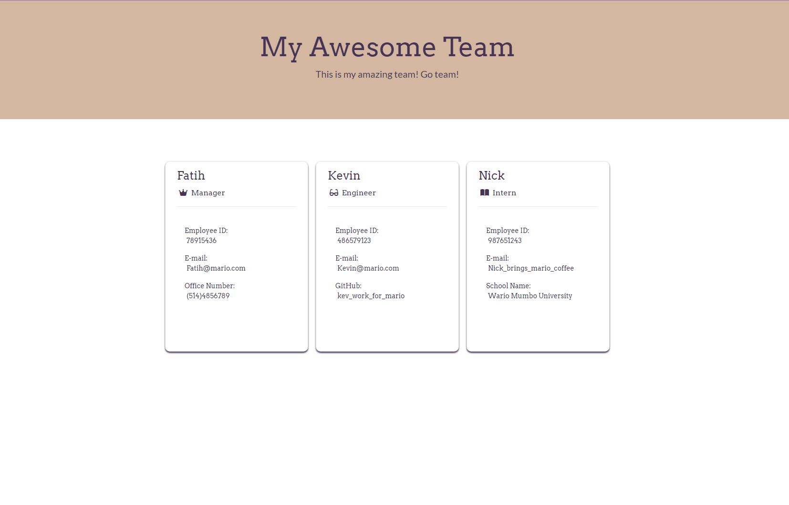

# <The-Amazing-Team-Profile-Generator>

## Description

This is a Node.js command-line application that takes in information about employees on a software engineering team. It generates an HTML webpage that displays information and summaries for each employee info input.

## Mock-Up

This following image shows a mock-up of a generated HTML, its appearance and functionality:

A completed example of this mock-up with the input's are available under "src/index.template.html" which can be edited to change as the user wishes. 

## Table of Contents

- [Installation](#installation)
- [Usage](#usage)
- [License](#license)
- [Contributing](#how-to-contribute)
- [Tests](#tests)
- [Author](#about-the-author)

## Installation

Before using this application, you must install the inquirer package.
Run the following command line to initialize a new package:
~~~
npm init -y
~~~

For this application we are using Inquirer version 8.2.4.
Run the following command to install the proper version and required package:
~~~
npm i inquirer@8.2.4
~~~

## Usage

Enter the following command in the command line to run the application:
~~~
node index
~~~

When prompted, input information in the command line in reference to the series of questions. To add a new employee, choose a role when prompted to add another employee.
Below is a mock-up of the command line. 

Click this link for a demonstration of how the application works:
[Click here for a video demonstration.](https://app.castify.com/watch/d5c517b2-2b08-4691-8062-14a1afef7906)

## License

- - - 

## Badges

Badges aren't necessary, but they demonstrate street cred. Badges let other developers know that you know what you're doing. Check out the badges hosted by [shields.io](https://shields.io/). You may not understand what they all represent now, but you will in time.

## How to Contribute

Ways to contribute include suggesting bug fixes, or styling advice.

## Tests

To run tests for this application, you will need the Jest testing framework.
After installing the necessary dependencies and setting up a package.json file, run the following command in the command line to initialize a new package:
~~~
npm init
~~~

Run the following command in the command line to install the Jest package:
~~~
npm install jest
~~~

Run the following command in the command line to run tests:
~~~
npm run test
~~~

## About the Author

My name is Claire and I am a student learning Web Development.